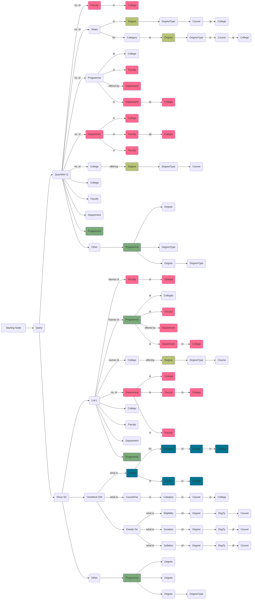

```mermaid
graph LR
    SN[Starting Node] --> Query(Query)
    Query --> Q1(Quantifier Q)
    %%Query --> L1(List L)
    %%Query --> O1(Other Queries O)
    Query --> Sh1(Show Sh)
    

    Q1 --> |no. of| F1(Faculty)
    F1 --> |in| COL1(College)

 
    Q1 --> |no. of| S1(Seats)
    S1 --> |in| Deg1(Degree)
    Deg1 --> DegTy1(DegreeType)
    DegTy1 --> C1(Course)
    C1 --> |at| COL5(College)

    S1   --> |for| CAT1(Category)
    CAT1 --> |in| Deg2(Degree)
    Deg2 --> DegTy2(DegreeType)
    DegTy2 --> |in| C4(Course)
    C4   --> |at| COL8(College)
 
    Q1 --> |no. of| P2(Programme)
    P2 --> |at| COL2(College)
 
    P2 --> |in| F3(Faculty)
   
    P2 --> |offered by| D3(Department)
 
    P2 --> |in| D1(Department)
    D1 --> |at| COL3(College)
 
    Q1 --> |no. of| D2(Department)
    D2 --> |in| COL6(College)
 
    D2 --> |in| F2(Faculty)
    F2 --> |att| COL7(College)
 
    D2 --> |in| F5(Faculty)
 
    %% Q1   --> |no. of| S2(Seats)

    %% S2   --> |for| CAT1(Category)
    %% CAT1 --> |in| C4(Course)
    %% C4   --> |at| COL8(College)
 
    %% S2   --> |in| C11(Course)
    %% C11  --> |at| COL14(College)


    OW1  --> |what is| CUT1(Cutoff)
    CUT1 --> |for| CAT2(Category)
    CAT2 --> |of| C6(Course)
    C6   --> |in| COL10(College)
 
    CUT1 --> |of| C12(Course)
    C12  --> |in| COL15(College)
 
    %%    |what is| cutoff --> category --> course --> college
    %%    |what is| coursefee --> category --> course --> college  
 
    OW1  --> |what is| CFE1(CourseFee)
    CFE1 --> |in| CAT3(Category)
    CAT3 --> |in| C7(Course)
    C7   --> |in| COL11(College)
 
    %%Q1 --> |no. of| COL12(College)
    %%COL12 --> |in| D4(Department)
 
    %%COL12 --> |in| F4(Faculty)

    Q1    --> |no. of| COL16(College)
    COL16 --> |offering| Deg3(Degree)
    Deg3 --> DegTy3(DegreeType)
    DegTy3 --> C13(Course)

    Q1 --> COL14(College)
    Q1 --> F10(Faculty)
    Q1 --> D5(Department)
    Q1 --> P1(Programme)

    Sh1 --> L1(List L)
    Sh1 --> OW1(OneWord OW)
    OW1(OneWord OW) --> De1(Details De)

    %%L1 --> |what is| E2(Eligibility)
    %%E2 --> |of| C8(Course)
 
    %%L1   --> |what is| DUR1(Duration)
    %%DUR1 --> |of| C9(Course)
 
    %%L1   --> |what is| SYL1(Syllabus)
    %%SYL1 --> |of| C10(Course)


    De1 --> |what is| E2(Eligibility)
    E2  -->  |of| Deg5(Degree) 
    Deg5 --> DegTy5(DegTy)
    DegTy5(DegTy) --> C8(Course)

    De1  --> |what is| DUR1(Duration)
    DUR1  -->  |of| Deg6(Degree) 
    Deg6 --> DegTy6(DegTy)
    DegTy6 --> |of| C9(Course)

    De1  --> |what is| SYL1(Syllabus)
    SYL1  -->  |of| Deg7(Degree) 
    Deg7 --> DegTy7(DegTy)
    DegTy7 --> |of| C10(Course)

    L1 --> |Names of| F6(Faculty)
    F6 --> |in| COL17(College)

    L1  --> |Names of| P4(Programme)
    P4 --> |at| COL18(Colleges)

    P4 --> |in| F7(Faculty)

    P4 --> |offered by| D6(Department)

    P4 --> |in| D7(Department)
    D7  --> |in| COL19(College)

    L1 --> |names of| COL22(College)
    COL22 --> |offering| Deg4(Degree)
    Deg4 --> DegTy4(DegreeType)
    DegTy4 --> C11(Course)

    L1 --> |no. of| D8(Department)
    D8 --> |in| COL20(College)

    D8 --> |in| F8(Faculty)
    F8 --> |in| COL21(College)

    D8 --> |in| F9(Faculty)

    L1 --> COL13(College)
    L1 --> F11(Faculty)
    L1 --> D9(Department)
    L1 --> P3(Programme)

    %%L1 --> |Names of| COL22(College)
    %%COL22 --> |offering| C15(Course)

    Q1 --> Ot1(Other) 
    Ot1 --> P5(Programme)
    P5 --> Deg8(Degree)

    P5 --> DegTy8(DegreeType)
    P5 --> Deg10(Degree) --> DegTy10(DegreeType)


    Sh1 --> Ot2(Other) 
    Ot2 --> P6(Programme)
    P6 --> Deg9(Degree)
    
    P6 --> DegTy9(Degree)
    P6 --> Deg11(Degree) --> DegTy11(DegreeType)


    style CUT1 fill:#00758f
    style CAT2 fill:#00758F
    style C6 fill:#00758f
    style C12 fill:#00758f
    style COL15 fill:#00758f
    style COL10 fill:#00758f

    
    style F1 fill:#ff698e
    style F2 fill:#ff698e
    style F3 fill:#ff698e

    style F5 fill:#ff698e
    style F6 fill:#ff698e
    style F7 fill:#ff698e
    style F8 fill:#ff698e

    style F9 fill:#ff698e

    style D1 fill:#ff698e
    style D2 fill:#ff698e
    style D3 fill:#ff698e

    style D6 fill:#ff698e
    style D7 fill:#ff698e
    style D8 fill:#ff698e


    style COL1 fill:#ff698e
    style COL3 fill:#ff698e
    style COL6 fill:#ff698e
    style COL7 fill:#ff698e
    style COL17 fill:#ff698e
    style COL19 fill:#ff698e
    style COL20 fill:#ff698e
    style COL21 fill:#ff698e

    style P1 fill:#7aab79
    style P3 fill:#7aab79
    style P4 fill:#7aab79
    style P5 fill:#7aab79
    style P6 fill:#7aab79
    
    style Deg1 fill:#b7c474
    style Deg2 fill:#b7c474
    style Deg3 fill:#b7c474
    style Deg4 txt:#00000, fill:#b7c474


    


    


```
c16 =  programme P1