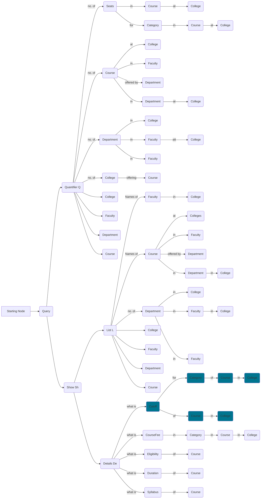

```mermaid
graph LR
    SN[Starting Node] --> Query(Query)
    Query --> Q1(Quantifier Q)
    %%Query --> L1(List L)
    %%Query --> O1(Other Queries O)
    Query --> Sh1(Show Sh)
    

    %%Q1 --> |no. of| F1(Faculty)
    %%F1 --> |in| COL1(College)

 
    Q1 --> |no. of| S1(Seats)
    S1 --> |in| C1(Course)
    C1 --> |at| COL5(College)

    S1   --> |for| CAT1(Category)
    CAT1 --> |in| C4(Course)
    C4   --> |at| COL8(College)
 
    Q1 --> |no. of| C2(Course)
    C2 --> |at| COL2(College)
 
    C2 --> |in| F3(Faculty)
   
    C2 --> |offered by| D3(Department)
 
    C2 --> |in| D1(Department)
    D1 --> |at| COL3(College)
 
    Q1 --> |no. of| D2(Department)
    D2 --> |in| COL6(College)
 
    D2 --> |in| F2(Faculty)
    F2 --> |att| COL7(College)
 
    D2 --> |in| F5(Faculty)
 
    %% Q1   --> |no. of| S2(Seats)

    %% S2   --> |for| CAT1(Category)
    %% CAT1 --> |in| C4(Course)
    %% C4   --> |at| COL8(College)
 
    %% S2   --> |in| C11(Course)
    %% C11  --> |at| COL14(College)


    De1  --> |what is| CUT1(Cutoff)
    CUT1 --> |for| CAT2(Category)
    CAT2 --> |of| C6(Course)
    C6   --> |in| COL10(College)
 
    CUT1 --> |of| C12(Course)
    C12  --> |in| COL15(College)
 
    %%    |what is| cutoff --> category --> course --> college
    %%    |what is| coursefee --> category --> course --> college  
 
    De1  --> |what is| CFE1(CourseFee)
    CFE1 --> |in| CAT3(Category)
    CAT3 --> |in| C7(Course)
    C7   --> |in| COL11(College)
 
    %%Q1 --> |no. of| COL12(College)
    %%COL12 --> |in| D4(Department)
 
    %%COL12 --> |in| F4(Faculty)

    Q1    --> |no. of| COL16(College)
    COL16 --> |offering| C13(Course)

    Q1 --> COL14(College)
    Q1 --> F10(Faculty)
    Q1 --> D5(Department)
    Q1 --> C16(Course)

    Sh1 --> L1(List L)
    Sh1 --> De1(Details De)

    %%L1 --> |what is| E2(Eligibility)
    %%E2 --> |of| C8(Course)
 
    %%L1   --> |what is| DUR1(Duration)
    %%DUR1 --> |of| C9(Course)
 
    %%L1   --> |what is| SYL1(Syllabus)
    %%SYL1 --> |of| C10(Course)


    De1 --> |what is| E2(Eligibility)
    E2  --> |of| C8(Course)

    De1  --> |what is| DUR1(Duration)
    DUR1 --> |of| C9(Course)

    De1  --> |what is| SYL1(Syllabus)
    SYL1 --> |of| C10(Course)

    L1 --> |Names of| F6(Faculty)
    F6 --> |in| COL17(College)

    L1  --> |Names of| C14(Course)
    C14 --> |at| COL18(Colleges)

    C14 --> |in| F7(Faculty)

    C14 --> |offered by| D6(Department)

    C14 --> |in| D7(Department)
    D7  --> |in| COL19(College)

    L1 --> |no. of| D8(Department)
    D8 --> |in| COL20(College)

    D8 --> |in| F8(Faculty)
    F8 --> |in| COL21(College)

    D8 --> |in| F9(Faculty)

    L1 --> COL13(College)
    L1 --> F11(Faculty)
    L1 --> D9(Department)
    L1 --> C17(Course)

    %%L1 --> |Names of| COL22(College)
    %%COL22 --> |offering| C15(Course)

    style CUT1 fill:#00758f
    style CAT2 fill:#00758F
    style C6 fill:#00758f
    style C12 fill:#00758f
    style COL15 fill:#00758f
    style COL10 fill:#00758f
```
