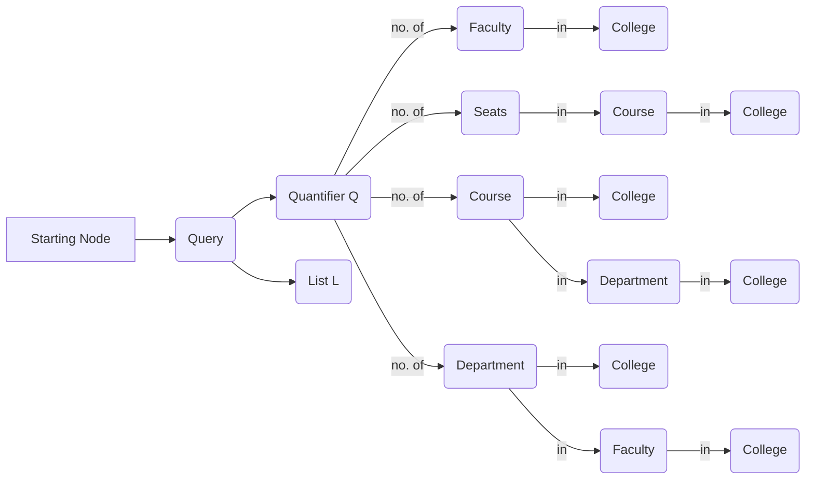

```mermaid
graph LR
    SN[Starting Node] --> Query(Query)
    Query --> Q1(Quantifier Q)
    Query --> L1(List L)

    Q1 --> |no. of| F1(Faculty)
    F1 --> |in| COL1(College)

    Q1 --> |no. of| S1(Seats)
    S1 --> |in| C1(Course)
    C1 --> |in| COL5(College)

    Q1 --> |no. of| C2(Course)
    C2 --> |in| COL2(College)

    C2 --> |in| D1(Department)
    D1 --> |in| COL3(College)

    Q1 --> |no. of| D2(Department)
    D2 --> |in| COL6(College)

    D2 --> |in| F2(Faculty)
    F2 --> |in| COL7(College)

    
```